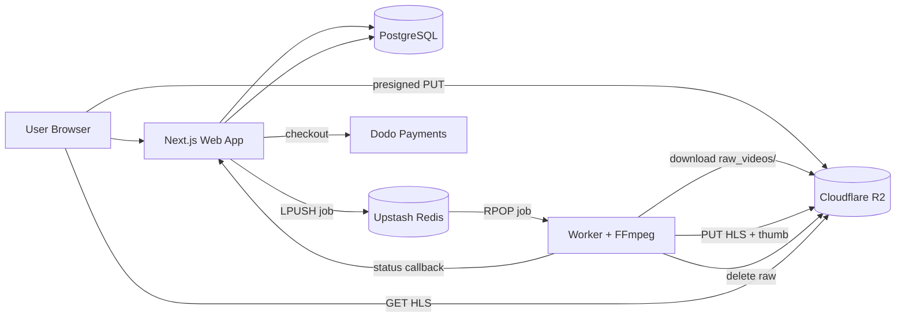

# Vidora

Full-stack video hosting platform: upload, async FFmpeg transcoding to adaptive HLS, and streaming playback — from one browser flow.

[Video on X](https://x.com/tanavtwt/status/2007356766284329173?s=20)

## Highlights

- Monorepo: Next.js web app + standalone transcoding worker
- Queue-driven media pipeline (Upstash Redis + FFmpeg) that never blocks the request path
- Multi-bitrate HLS (240p/480p/720p/1080p), per-video rendition selection
- Direct-to-R2 presigned PUT uploads
- Google OAuth, per-user library, quota plans (free 3/mo, Plus 10/mo)

## Features

- Google sign-in (Better Auth), per-user video library
- Drag-and-drop upload via presigned R2 URLs, client-side progress
- User-selectable output renditions per video (defaults to all four)
- Background FFmpeg transcoding → adaptive HLS + master playlist, accurate `RESOLUTION` metadata
- Auto thumbnails (first frame) and sprite thumbnail track (`thumbnails.vtt`)
- Jobs page with live progress polling; retry-aware queue (3 attempts)
- Public watch pages `/w/[id]`, view counts, likes, share links
- Monthly upload quotas, Dodo Payments checkout (Plus)

## Architecture



### Services

| Piece | Role |
| --- | --- |
| `web/` | Next.js App Router app. Auth, quotas, upload initiation, dashboards, watch pages. API via Hono mounted at `/api`. |
| `worker/` | Long-running Node service. Pops queue jobs, downloads sources, runs FFmpeg, uploads HLS assets, sprites and thumbnails to R2, reports progress back. |
| PostgreSQL + Prisma | Users, sessions, and video metadata. |
| Upstash Redis | Job queue (`video-queue`), delayed retry set, transient progress cache. |
| Cloudflare R2 | All media: raw `raw_videos/` intake, HLS assets, sprites, thumbnails — served publicly. |
| Dodo Payments | Plus plan checkout + webhook → grants quota bump. |

### Upload → Playback flow

1. User signs in; frontend requests a short-lived presigned PUT URL and uploads the raw file straight to R2 (`raw_videos/{id}.{ext}`).
2. `POST /api/upload` validates, applies quota, creates the video row (with chosen renditions), and `LPUSH`es a job.
3. Worker `RPOP`s the job, downloads the raw from `raw_videos/` via R2, transcodes selected renditions, builds the master playlist + sprites, and PUTs everything to R2 (`{id}/...`).
4. Worker deletes the raw `raw_videos/{id}.{ext}` object from R2 once transcoding succeeds.
5. Worker reports progress via `POST /api/status/:id` (shared-secret header). Failed jobs retry with exponential delay up to 3 times.
6. `/tasks` polls status; `/w/[id]` streams via HLS once `status = done`.

### API surface (all under `/api`)

- `GET` `POST` `/auth/*` — Better Auth
- `POST /upload` — create record + enqueue job
- `GET`/`POST /upload/p/:id` — presigned R2 PUT URL
- `GET /videos` · `PATCH`/`DELETE /videos/:id`
- `POST /videos/:id/view | like | share`
- `GET` `POST /status/:id` — progress read + worker callback
- `GET /quota` · `GET /billing/checkout` · `POST /billing/dodo/webhook`
- `POST /delete`

## Stack

Next.js 16 · React 19 · TypeScript · Hono · Better Auth · Prisma + PostgreSQL · Upstash Redis · Cloudflare R2 · FFmpeg · TanStack Query · Video.js · Tailwind CSS

## Local Development

```bash
# 1. install (Bun works too)
npm install
npm --prefix web install
npm --prefix worker install

# 2. db
cd web && npx prisma generate && npx prisma migrate dev
```

### Env vars

`web/.env` (see `web/.env.example`):

```env
DATABASE_URL=            UPSTASH_REDIS_REST_URL=   UPSTASH_REDIS_REST_TOKEN=
R2_ACCESS_KEY_ID=        R2_ACCESS_KEY_SECRET=     R2_CLIENT_URL=          R2_PUBLIC_URL=
NEXT_PUBLIC_R2_PUBLIC_URL=  GOOGLE_CLIENT_ID=       GOOGLE_CLIENT_SECRET=
AUTH_SECRET=             WORKER_SHARED_SECRET=
DODO_PAYMENTS_API_KEY=   WEBHOOK_SECRET_KEY=       PREMIUM_PRODUCT_ID=     NEXT_PUBLIC_APP_URL=
```

`worker/.env` (see `worker/.env.example`):

```env
CLOUDFLARE_ACCOUNT_ID=   R2_ACCESS_KEY_ID=      R2_SECRET_ACCESS_KEY=
UPSTASH_REDIS_REST_URL=  UPSTASH_REDIS_REST_TOKEN=   BACKEND_URL=http://localhost:3000
WORKER_SHARED_SECRET=
```

`WORKER_SHARED_SECRET` must match in both services to protect the status callback.

### Run

```bash
npm --prefix web run dev      # http://localhost:3000
npm --prefix worker run dev   # consumes jobs (requires FFmpeg)
```

Root scripts: `npm run dev` runs both; `npm run build:web|worker`, `npm run lint:web`, `npm run typecheck:worker`.

## Deployment

- **Web** → Vercel (root dir `web`, build `npm run build`). Needs Node runtime for Prisma + auth.
- **Worker** → Railway or any Docker host using `worker/Dockerfile` (installs FFmpeg). Restart policy: always.
- **Managed deps** → Postgres, Upstash Redis, Cloudflare R2 (public bucket), Google OAuth, Dodo Payments.

Rollout: provision services → apply `prisma migrate deploy` → deploy web (verify `/login`, sign-in, pages) → deploy worker (verify FFmpeg, Redis, callbacks) → validate one upload end-to-end.

Operational notes: set strong `AUTH_SECRET` + `WORKER_SHARED_SECRET`, least-privilege R2 creds, restricted OAuth callback URLs. Log web failures, worker job lifecycle, FFmpeg/R2 failures. Worker is stateless — scale replicas freely.

### Common failures

- Worker can't report → check `BACKEND_URL`, `WORKER_SHARED_SECRET`, worker→web network.
- Playback 404 → R2 upload/cert, public bucket, `R2_PUBLIC_URL`.
- Jobs never finish → Redis creds, worker health, FFmpeg in runtime, R2 creds.
